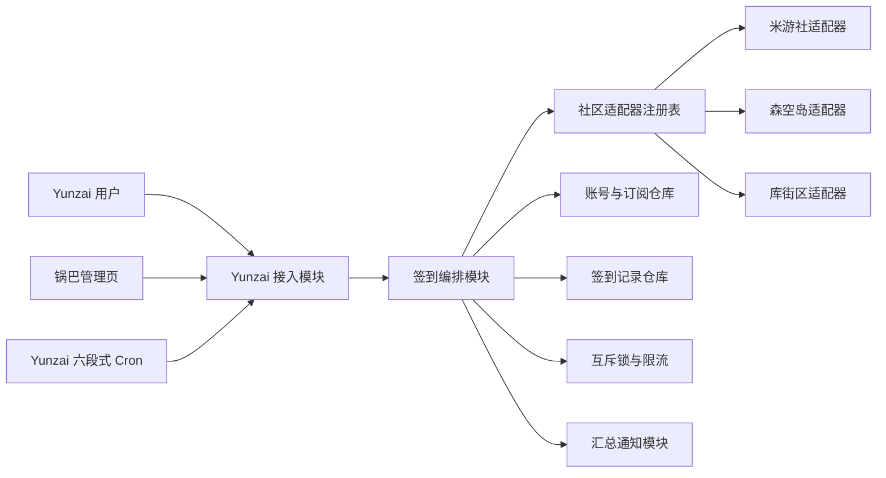

# A-game-checkin 设计方案

## 1. 目标

把分散在不同游戏社区里的每日签到统一接入 Yunzai。用户只需要在私聊或管理页面绑定社区账号，之后可手动执行或开启每日自动签到，并收到一条汇总结果。

首版应优先解决：

1. 一个 Yunzai 用户绑定多个社区账号。
2. 一个社区账号自动发现多个签到目标。
3. 手动签到、自动签到、状态查询和失效提醒。
4. 新增社区时只增加一个适配器，不修改命令和调度流程。
5. 凭证不以明文出现在日志、群聊回复和错误信息中。

首版不做游戏内登录、不领取游戏内邮件、不做任务自动化，也不承诺绕过验证码或社区风控。

## 2. 范围建议

不要在第一个版本同时覆盖所有“二游”。推荐按社区而不是按游戏分批接入：

| 阶段 | 社区 | 目的 |
| --- | --- | --- |
| MVP | 米游社 | 验证“一份社区凭证发现多个游戏签到目标” |
| v1 | 森空岛、库街区 | 验证不同认证、签名和目标粒度的适配能力 |
| v1.x | 其他有稳定网页签到入口的社区 | 按用户需求和接口稳定性接入 |

每个社区进入支持列表前都要完成一次可行性评估：登录凭证如何取得、是否存在验证码、请求签名是否可稳定生成、是否允许多角色、失败码是否可识别、接口条款与封号风险。

## 3. 总体结构



Yunzai 只负责三件事：接收命令、触发定时任务、发送消息。社区请求、重试、幂等、凭证状态和结果归一化全部隐藏在签到编排模块之后。

这是本项目最重要的 seam：Yunzai 层不应知道 Cookie 字段、社区 URL、请求签名或游戏活动 ID。

## 4. 核心模块

### 4.1 Yunzai 接入模块

对外提供以下命令，命令名称可在实现阶段统一加 `#` 前缀：

| 命令 | 作用 | 使用位置 |
| --- | --- | --- |
| `签到帮助` | 显示支持社区与操作说明 | 群聊/私聊 |
| `绑定签到 <社区>` | 开始绑定上下文 | 仅私聊 |
| `签到账号` | 列出账号、凭证状态和目标 | 私聊 |
| `签到目标` | 列出目标并开启/关闭自动签到 | 私聊 |
| `全部签到` | 执行当前用户所有启用目标 | 私聊 |
| `<社区>签到` | 只执行指定社区 | 私聊 |
| `签到记录` | 查看最近结果 | 私聊 |
| `删除签到账号 <编号>` | 二次确认后删除凭证及订阅 | 仅私聊 |

群聊中收到绑定或展示账号详情的命令时，只提示用户转私聊，不进入凭证收集流程。

定时入口采用 Yunzai 原生六段式 Cron，但 Cron 只负责唤醒扫描，不直接遍历并请求全部社区。

### 4.2 签到编排模块

这是一个深模块，对命令入口和定时入口提供尽量小的 interface：

```ts
type RunScope =
  | { kind: 'user'; userId: string; community?: string }
  | { kind: 'due-subscriptions'; now: Date }

interface CheckinCoordinator {
  run(scope: RunScope): Promise<CheckinBatchResult>
  refreshAccount(accountId: string): Promise<AccountSnapshot>
}
```

它内部负责：

- 读取账号、凭证和启用订阅；
- 取得分布式锁，防止手动和定时任务重复签到；
- 按社区和账号分组，账号内串行、账号间有限并发；
- 将社区错误转换成统一结果；
- 对暂时失败执行带抖动的指数退避；
- 保存签到尝试并更新凭证状态；
- 生成一条用户级汇总通知。

调用方不应自己实现重试、日志脱敏或“今日已签到”的判断。

### 4.3 社区适配器

每个社区实现同一个 interface：

```ts
interface CommunityAdapter {
  readonly id: string
  validateCredential(input: CredentialInput): Promise<CredentialProfile>
  discoverTargets(credential: SecretCredential): Promise<DiscoveredTarget[]>
  checkIn(
    credential: SecretCredential,
    target: CheckinTarget,
    context: CheckinContext
  ): Promise<AdapterOutcome>
}
```

约束：

- `validateCredential` 既验证凭证，也返回可安全展示的账号昵称或脱敏标识。
- `discoverTargets` 负责发现游戏、角色或活动，核心层不维护社区活动 ID 常量。
- `checkIn` 必须把响应解析成结构化结果，禁止把响应文本直接作为业务判断。
- 适配器可以有私有的 HTTP 客户端、签名器、设备标识和响应解析器，但这些不进入外部 interface。
- 原始请求和响应默认不落盘；调试日志也必须先脱敏。

推荐的归一化结果：

```ts
type AdapterOutcome =
  | { kind: 'success'; reward?: RewardSummary }
  | { kind: 'already-done' }
  | { kind: 'auth-expired'; reason: string }
  | { kind: 'risk-control'; reason: string }
  | { kind: 'retryable'; reason: string; retryAfterMs?: number }
  | { kind: 'permanent-failure'; reason: string }
```

“验证码/人机验证”统一归为 `risk-control`，停止自动重试并通知用户手动处理，不提供绕过机制。

### 4.4 账号与订阅仓库

建议的数据关系：

```text
User 1 ── N CommunityAccount 1 ── N CheckinTarget 1 ── 0..1 Subscription
                                      │
                                      └── N CheckinAttempt
```

关键字段：

- `CommunityAccount`: `id`、`userId`、`communityId`、`displayName`、`credentialRef`、`credentialStatus`
- `CheckinTarget`: `id`、`accountId`、`externalId`、`displayName`、`businessTimezone`、`metadata`
- `Subscription`: `targetId`、`enabled`、`preferredWindow`、`notifyPolicy`
- `CheckinAttempt`: `targetId`、`businessDate`、`attemptNo`、`resultKind`、`reasonCode`、`startedAt`、`finishedAt`

数据库中的唯一约束应至少覆盖：

```text
(account_id, external_id)
(target_id, business_date, successful_or_already_done)
```

不要把游戏 UID 当作签到目标的全局主键；不同社区、区服和活动可能重复。

### 4.5 凭证保险箱

凭证与普通配置分开保存：

- 使用 Node.js 内置 `crypto` 的 AES-256-GCM 加密后落盘；
- 主密钥通过环境变量注入，不提交仓库，不写入锅巴配置；
- 每条密文使用独立随机 IV，并保存认证标签和密钥版本；
- 数据文件仅允许运行用户读写；
- 回复、日志、异常和监控中统一使用脱敏后的账号标识；
- 删除账号时同时删除密文、目标和订阅，签到历史只保留匿名目标描述或一并删除，由产品策略决定。

若没有配置主密钥，插件应拒绝保存新凭证，而不是退化为明文存储。

## 5. 自动签到流程

1. Yunzai Cron 每隔一段时间唤醒扫描器。
2. 扫描器根据每个目标的业务日期和首选时间窗找出到期订阅。
3. 为 `(社区, 账号, 目标, 业务日期)` 申请带过期时间的锁。
4. 检查当日是否已有 `success` 或 `already-done` 记录。
5. 调用对应社区适配器。
6. 暂时失败最多重试 2～3 次；认证失效、风控和永久失败不自动重试。
7. 保存结果并释放锁。
8. 同一用户的一批任务结束后发送一条汇总消息。

应给不同用户增加随机抖动，避免每天固定时刻形成请求尖峰。并发上限应能按社区单独配置，默认保守，例如每个社区 2～3 个并发。

## 6. 绑定流程

推荐首版采用“私聊粘贴 Cookie/Token + 锅巴可选配置”的方式：

1. 用户私聊发送 `绑定签到 米游社`。
2. 插件说明凭证用途、风险和删除方式，并进入一次性输入上下文。
3. 用户发送凭证；插件立即撤回或尽量减少消息留存。
4. 适配器验证凭证并发现签到目标。
5. 插件展示脱敏账号和目标列表，让用户确认启用哪些自动签到。
6. 确认后才加密保存。

不建议首版自建公网 OAuth/扫码回调页面：多数社区没有正式开放授权，公网回调还会扩大凭证泄露和运维风险。将来若某社区提供正式 OAuth，再在该适配器内部增加授权方式。

## 7. 配置分层

普通配置可使用 YAML，并通过 `guoba.support.js` 接入锅巴：

```yaml
scheduler:
  cron: "0 */10 * * * *"
  defaultWindow: "06:00-09:00"
  maxConcurrentAccounts: 3
retry:
  maxAttempts: 3
notification:
  onSuccess: summary
  onFailure: immediate
communities:
  miyoushe:
    enabled: true
    concurrency: 2
```

锅巴只管理非敏感全局配置。用户凭证不能作为锅巴普通配置字段返回给浏览器。

## 8. 目录建议

```text
A-game-checkin/
├── apps/                         # Yunzai 命令和定时入口
│   ├── account.js
│   ├── checkin.js
│   └── scheduler.js
├── lib/
│   ├── checkin/                  # 编排、结果与策略
│   ├── communities/
│   │   ├── registry.js
│   │   ├── miyoushe/
│   │   ├── skland/
│   │   └── kuro/
│   ├── persistence/              # 账号、订阅、记录
│   ├── secrets/                  # 加解密与脱敏
│   └── notification/
├── config/
│   ├── default.yaml
│   └── config.yaml               # 运行时生成且不入库
├── resources/
├── test/
│   ├── contract/                 # 所有社区适配器共享的契约测试
│   ├── fixtures/                 # 脱敏后的响应样本
│   └── unit/
├── guoba.support.js
├── index.js
└── package.json
```

即使首版使用 JavaScript，也建议通过 JSDoc 或 TypeScript 声明固定适配器和结果类型，避免社区响应字段蔓延到核心流程。

## 9. 测试策略

优先验证接口而不是私有实现：

- 社区适配器契约测试：有效凭证、过期凭证、目标发现、成功、重复签到、风控、限流和未知响应。
- 编排单元测试：幂等、锁冲突、重试次数、账号内串行、跨账号并发和汇总规则。
- 凭证测试：密文不可包含原文、错误主密钥无法解密、日志脱敏。
- Yunzai 接入测试：群聊不能绑定、私聊上下文超时、删除需要二次确认。
- 端到端测试：使用录制并脱敏的响应 fixture，不在 CI 中使用真实用户 Cookie。

新增社区的完成标准不是“真实账号签成功一次”，而是适配器契约测试全部通过并覆盖已知错误码。

## 10. 可观测性

结构化日志至少包含：

```text
traceId, communityId, accountId(内部ID), targetId,
businessDate, attemptNo, resultKind, durationMs, reasonCode
```

禁止包含 Cookie、Token、完整 UID、手机号、请求头和未脱敏响应体。

管理员需要看到聚合指标：当日成功率、认证失效数、风控数、社区接口暂时失败数和任务积压数。当某社区大面积失败时，可单独熔断该适配器，避免继续请求。

## 11. 交付路线

### 里程碑 0：骨架

- 初始化 Yunzai v3 插件结构；
- 建立结果类型、适配器注册表、内存仓库和契约测试；
- 完成命令入口与 Cron 空跑。

### 里程碑 1：单社区闭环

- 实现米游社适配器；
- 完成私聊绑定、目标发现、手动签到；
- 实现加密存储、幂等、重试和汇总通知。

### 里程碑 2：自动化与管理

- 自动签到时间窗、随机抖动和失败提醒；
- 锅巴非敏感配置；
- 账号查看、更新凭证和删除流程。

### 里程碑 3：验证扩展性

- 再接入一个认证和响应形态明显不同的社区；
- 用第二个适配器检验现有 interface，必要时调整；
- 补齐社区级限流、熔断和运维指标。

## 12. 开工前需要确认的产品决策

1. 首发运行环境是 Miao-Yunzai、TRSS-Yunzai，还是要求同时兼容两者。
2. MVP 首个社区是否确定为米游社，以及首批具体游戏。
3. 用户是否允许同一社区绑定多个账号。
4. 成功时每天都通知，还是只在失败时通知。
5. 凭证输入只支持私聊，还是还要提供仅机器人管理员可访问的本地管理页。

这些选择不会改变核心适配器架构，但会影响命令、持久化和兼容性测试范围。

## 参考

- [Yunzai 插件快速上手与定时任务](https://yunzai-bot.com/dev/quick-start)
- [Yunzai 项目配置与锅巴配置入口](https://yunzai-bot.com/get-started/config.html)
- [Guoba-Plugin 配置支持示例](https://gitee.com/guoba-yunzai/guoba-plugin/blob/master/guoba.support.js)
- [Yunzai-Bot 插件生态索引](https://github.com/yhArcadia/Yunzai-Bot-plugins-index)
